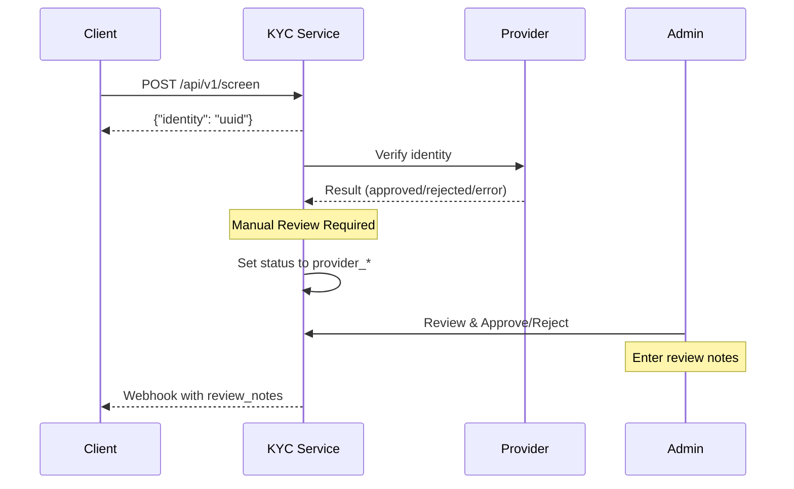

# API Workflows Example

This guide provides quick examples for integrating external services with the KYC microservice. All requests require the `X-API-KEY` header with a valid API key from the dashboard.

**Base URLs:**
- Staging: `https://kyc-staging.ablegroup.sg`
- Production: `https://kyc.ablegroup.sg`

## 1. Submit KYC Screening Request

- **Endpoint**: `POST /api/v1/screen`
- **Headers**
  - `Content-Type: application/json`
  - `X-API-KEY: <your-api-key>`
- **Purpose**: Create a new KYC profile. The service returns a reference UUID immediately; verification results are delivered via webhook or `GET /status`.

### Request payload

```json
{
  "personal_info": {
    "first_name": "Jane",
    "last_name": "Doe",
    "gender": "Female",
    "date_of_birth": "1990-03-12",
    "nationality": "ID"
  },
  "identification": {
    "id_type": "national_id",
    "id_number": "3321123456789001",
    "issuing_country": "ID",
    "issue_date": "2015-05-01",
    "expiry_date": "2030-05-01"
  },
  "address": {
    "address_line": "Jl. Jendral Sudirman No. 1",
    "street": "Jl. Jendral Sudirman",
    "city": "Jakarta",
    "state": "DKI Jakarta",
    "postal_code": "12190",
    "country": "ID"
  },
  "contact": {
    "email": "jane.doe@example.com",
    "phone": "+628123456789"
  },
  "meta": {
    "service_provider": "regtank",
    "reference_id": "PARTNER-REF-20240115-0001"
  }
}
```

### Response payload

```json
{
  "meta": {
    "code": 200,
    "message": "Screening successful",
    "request_id": "568b7e63-10ac-4c72-9764-1f148b0fb9d0"
  },
  "data": {
    "identity": "568b7e63-10ac-4c72-9764-1f148b0fb9d0"
  }
}
```

Save the `identity` value for subsequent polling or webhook cross-reference.

## 2. Query Screening Status

- **Endpoint**: `GET /api/v1/status/{uuid}`
- **Headers**
  - `X-API-KEY: <your-api-key>`
- **Purpose**: Poll for the latest verification status. Use this when webhook has not yet been received.

### Request example

```
GET /api/v1/status/568b7e63-10ac-4c72-9764-1f148b0fb9d0
```

### Response example (pending)

```json
{
  "meta": {
    "code": 200,
    "message": "Status retrieved successfully",
    "request_id": "f3c3c98b-2dfc-4c87-9c6e-2ab2f4210799"
  },
  "data": {
    "uuid": "568b7e63-10ac-4c72-9764-1f148b0fb9d0",
    "status": "pending",
    "provider": "regtank",
    "provider_reference_id": "RT-REQ-992201",
    "created_at": "2024-01-15T02:14:01.000000Z",
    "updated_at": "2024-01-15T02:14:01.000000Z"
  }
}
```

### Response example (approved)

```json
{
  "meta": {
    "code": 200,
    "message": "Status retrieved successfully",
    "request_id": "2f3b145d-7d7c-4d3f-9d06-37af52c9f303"
  },
  "data": {
    "uuid": "568b7e63-10ac-4c72-9764-1f148b0fb9d0",
    "status": "approved",
    "provider": "regtank",
    "provider_reference_id": "RT-REQ-992201",
    "created_at": "2024-01-15T02:14:01.000000Z",
    "updated_at": "2024-01-15T02:16:22.000000Z"
  }
}
```

## 3. Handle Webhook Callback

When verification is complete, the microservice sends a POST request to your configured `webhook_url` with a standardized payload.

### Webhook payload example

```json
{
  "event": "kyc.status.changed",
  "payload": {
    "msa_reference_id": "568b7e63-10ac-4c72-9764-1f148b0fb9d0",
    "provider_reference_id": "RT-REQ-992201",
    "reference_id": "PARTNER-REF-20240115-0001",
    "platform": "regtank",
    "status": "approved",
    "verified": true,
    "verified_at": "2024-01-15T02:16:22.000000Z",
    "rejected_at": null,
    "message": "KYC verification completed risk level: low",
    "review_notes": "Identity verified, all documents authentic",
    "reviewed_by": "Admin User",
    "reviewed_at": "2024-01-15T02:20:00.000000Z",
    "original_provider_status": "provider_approved",
    "failure_reason": null
  }
}
```

### Field Descriptions

| Field | Description |
|-------|-------------|
| `msa_reference_id` | UUID generated by the microservice (same as `identity` from `/screen`) |
| `reference_id` | Your internal reference ID passed in `meta.reference_id` |
| `status` | Final status: `approved`, `rejected`, `pending`, `error`, or `unresolved`. With Manual Review enabled, intermediate statuses are `provider_approved`, `provider_rejected`, or `provider_error` |
| `message` / `review_notes` | Provider status message or admin review notes |
| `reviewed_by` / `reviewed_at` / `original_provider_status` | Present only if manual review was performed |

**Retry Policy:** Failed webhook deliveries are automatically retried up to 3 times. Implement idempotent handling and respond with 2xx status codes to avoid duplicate processing.

## 3.1 Manual Review Workflow (Optional)

When the API key has `need_manual_review = true` configured in the dashboard, a manual review step is required:

1. **Provider returns result** → Profile status set to intermediate status (`provider_approved`, `provider_rejected`, or `provider_error`)
2. **Awaiting review** → Webhook is **NOT** sent yet
3. **Admin reviews** → Admin approves or rejects in the Dashboard with required review notes
4. **Webhook sent** → Final status determined, webhook includes review information



### Status Mapping Table

| Provider Result | Intermediate Status | Final Status |
|-----------------|---------------------|--------------|
| Approved | `provider_approved` | `approved` or `rejected` (can override) |
| Rejected | `provider_rejected` | `approved` or `rejected` (can override) |
| Error | `provider_error` | `approved` or `rejected` (can override) |

> **Note:** Reviewers can override the provider's decision. For example, a provider-approved case can be manually rejected, and vice versa.

### Response example (provider_approved - awaiting review)

```json
{
  "meta": {
    "code": 200,
    "message": "Status retrieved successfully",
    "request_id": "a1b2c3d4-5e6f-7a8b-9c0d-1e2f3a4b5c6d"
  },
  "data": {
    "uuid": "568b7e63-10ac-4c72-9764-1f148b0fb9d0",
    "status": "provider_approved",
    "provider": "regtank",
    "provider_reference_id": "RT-REQ-992201",
    "created_at": "2024-01-15T02:14:01.000000Z",
    "updated_at": "2024-01-15T02:16:22.000000Z"
  }
}
```

## 4. Test Provider (Optional)

In sandbox or CI environments, set `meta.service_provider` to `test` and use `meta.status` to simulate specific outcomes:

```json
{
  "meta": {
    "service_provider": "test",
    "reference_id": "TEST-REF-001",
    "status": "rejected"
  }
}
```

The system will automatically update the profile status and send the webhook within 5-10 seconds, making it easy to verify your integration and error handling logic.

### Available Test Statuses

| Status | Description |
|--------|-------------|
| `approved` | Simulates successful verification |
| `rejected` | Simulates failed verification |
| `error` | Simulates system error |
| `unresolved` | Simulates manual review required |

## 5. Webhook Security (Optional)

If your API key has a `signature_key` configured, webhooks include HMAC-SHA256 signatures for verification:

| Header | Description |
|--------|-------------|
| `X-Webhook-Signature` | HMAC-SHA256 signature |
| `X-Webhook-Timestamp` | Unix timestamp |

See [Webhook Security](./webhook-security.md) for verification examples.
