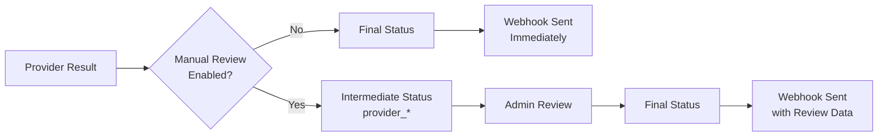

# How the KYC Microservice Works

This document consolidates the primary workflows implemented in the KYC microservice. It covers how requests enter the system, how each provider integration behaves, and how callbacks are propagated back to upstream services.

## 1. Entry Points and Authentication

- `POST /api/v1/screen` and `GET /api/v1/status/{uuid}` are protected by `VerifyApiKey`, which resolves the `X-API-KEY` header to a `UserApiKey` record and injects it into the request.
- `ScreenRequest` validates the payload (personal info, identification, address, optional contact, and `meta.service_provider`). Only `regtank`, `glair`, or `test` are accepted values.
- `KYCScreenController@screen` generates a UUID, builds `UserDataDTO`, and uses `KYCServiceFactory` to create the provider-specific service. The controller only returns `['identity' => uuid]` and the request flow immediately ends on the HTTP side.
- `KYCScreenController@status` scopes the lookup to the authenticated API key and returns the profile status, provider, provider reference, and timestamps for clients that prefer polling.

## 2. Profile Creation and Shared Data

- All services persist a `KYCProfile` with:
  - `id` set to the generated UUID.
  - Raw request data saved in `profile_data`.
  - `user_id` and `user_api_key_id` linking back to the caller.
  - `provider` and `provider_reference_id` (if available).
  - `status` initialized to `pending` (`KycStatuseEnum` is used for type safety).
- The associated `UserApiKey` contains:
  - `webhook_url`: The destination for outbound webhook notifications once the verification status changes.
  - `need_manual_review`: Boolean flag controlling whether manual admin review is required before sending webhooks (default: `false`).

## 3. Provider-Specific Flows

### Regtank

1. `RegtankService` retrieves an OAuth token via `RegtankAuth` (token cached until expiry).
2. Request data is transformed into Regtank’s expected shape (combined address, split DOB, uppercase gender).
3. The service sends a synchronous request to `/v2/djkyc/exchange/input` and stores the returned `requestId` as `provider_reference_id`.
4. No status is returned immediately—Regtank later calls the webhook endpoints with the result.

### GlairAI

1. `GlairAIService` only creates the profile and validates KTP/NIK data.
2. It dispatches `GlairAIVerificationJob`, which loads the profile, performs the actual API call to `/identity/v1/verification`, and updates the profile status.
3. `verification_status` drives whether the profile moves to `approved` or `rejected`. Exceptions set the status to `error`.

### Test Provider

1. `TestService` is designed for integration testing. It creates the profile and schedules `TestKYCResultJob`.
2. The job reads `meta.status` (if provided) to decide the final status; otherwise it defaults to `approved`.
3. The simulated response is stored in `provider_response_data` so downstream systems can inspect it if needed.

## 4. Webhook Handling and Propagation

### Incoming Webhooks (Regtank)

- Regtank hits `/webhooks/kyc` with its result payload.
- `RegtankWebhookController` maps Regtank’s `status` into the internal enum, updates the `KYCProfile`, and captures provider-specific metadata (risk level, timestamp) for inclusion in outbound notifications.
- Separate endpoints exist for `/webhooks/liveness` and `/webhooks/djkyb`, which forward data to `EFormAppService`.

### Outgoing Webhooks (All Providers)

- Every provider ultimately triggers `SendKycWebhookJob` once the profile status changes, whether the change came from a Regtank webhook or an internal job (GlairAI/Test).
- The job fetches the profile plus `UserDataDTO`, builds a normalized payload:
  - `event`: `kyc.status.changed`
  - `payload`: includes `msa_reference_id` (internal UUID), `provider_reference_id`, the client’s original `meta.reference_id`, provider name, status, timestamps, and optional failure reasons or risk info.
- The job posts to the client's configured `webhook_url` with a 30-second timeout and retries up to three times. Failures are logged for manual intervention.
- **Important**: If `need_manual_review` is enabled on the API key, webhooks are only dispatched after admin review (see Section 4.1 below).

### 4.1 Manual Review Workflow (Optional)

When `UserApiKey.need_manual_review` is set to `true`, an additional review step is inserted between provider results and client webhook notifications:

**Status Flow with Manual Review:**
1. Provider returns result (approved/rejected/error)
2. `KycWorkflowService::resolveStatus()` converts to intermediate status:
   - `approved` → `provider_approved`
   - `rejected` → `provider_rejected`
   - `error` → `provider_error`
3. `KycWorkflowService::shouldDispatchWebhook()` returns `false` – no webhook sent yet
4. Admin reviews in Dashboard (KYC Profiles page with Approve/Reject buttons)
5. `KycWorkflowService::processReview()` updates profile with:
   - Final status (`approved` or `rejected`)
   - `review_notes` (required, min 10 characters)
   - `reviewed_by` and `reviewed_at` timestamps
   - `provider_status` preserves original provider result
6. `SendKycWebhookJob` dispatched with review metadata

**Key Features:**
- **Reviewer Override**: Admins can approve a provider-rejected profile or reject a provider-approved one
- **Error Review**: Even `error` status requires review when enabled
- **Audit Trail**: Original provider status preserved in `provider_status` field
- **Review Notes**: Required field included in webhook payload

**Backward Compatibility:**
- Default `need_manual_review=false` ensures existing API keys work unchanged
- New intermediate statuses only appear when manual review is enabled

## 5. Observability and Client Interaction

- Clients receive immediate acknowledgement with the generated UUID and can:
  - Wait for the outbound webhook to receive the final decision.
  - Poll `GET /api/v1/status/{uuid}` for the latest status, which will always reflect the same state as the webhook payload.
- `ApiRequestLog` and `WebhookLog` capture request/response pairs for auditing each provider and webhook attempt.
- Queue jobs (`GlairAIVerificationJob`, `TestKYCResultJob`, `SendKycWebhookJob`) all implement retry/backoff policies and mark profiles as `error` when retries are exhausted, ensuring the status endpoint stays consistent even when callbacks fail.

This end-to-end flow ensures that upstream services can treat the microservice as an asynchronous KYC broker: they send one request, receive a reference identifier, and rely on either configured webhooks or the status API to learn the result once the underlying provider finishes screening.
