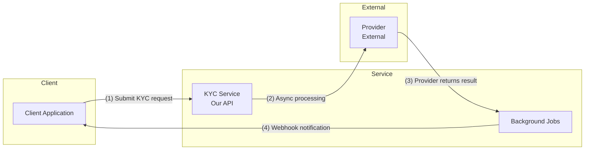
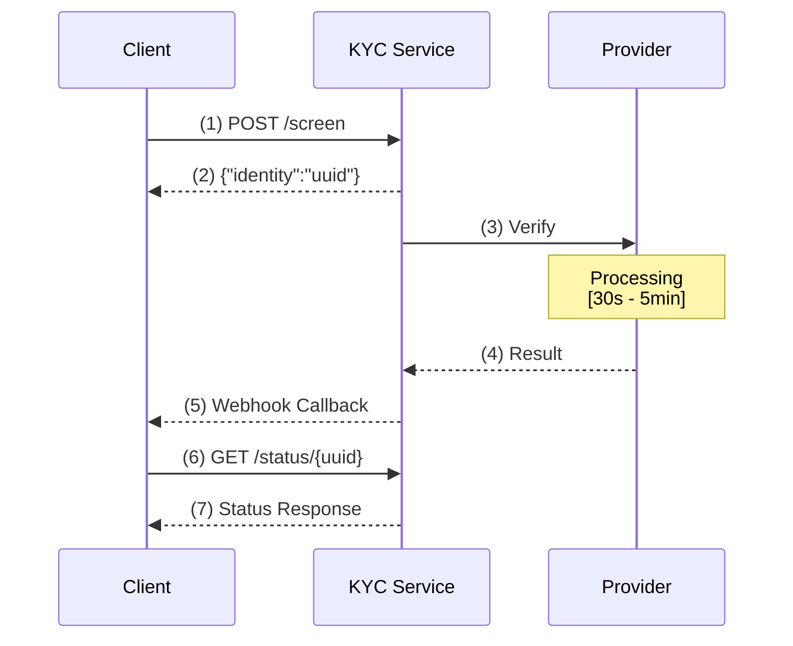
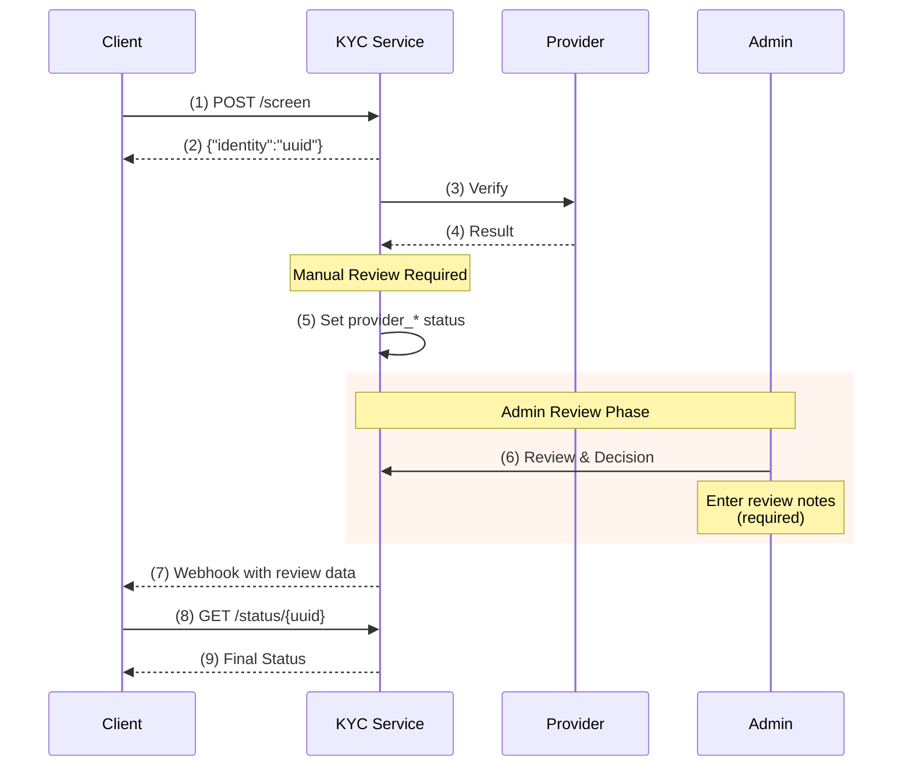

# KYC Microservice Integration Guide

**Version:** 1.1
**Last Updated:** 2026-01-06
**API Version:** v1

---

## Table of Contents

1. [Introduction](#introduction)
2. [Prerequisites](#prerequisites)
3. [Authentication](#authentication)
4. [Quick Start](#quick-start)
5. [API Endpoints](#api-endpoints)
6. [Request/Response Formats](#requestresponse-formats)
7. [Async Workflow](#async-workflow)
8. [Manual Review Workflow (Optional)](#manual-review-workflow-optional)
9. [Webhook Integration](#webhook-integration)
10. [Status Polling](#status-polling)
11. [Error Handling](#error-handling)
12. [Testing](#testing)
13. [Code Examples](#code-examples)
14. [Best Practices](#best-practices)
15. [Troubleshooting](#troubleshooting)

---

## Introduction

The KYC Microservice provides standardized **Know Your Customer (KYC)** verification services across multiple providers through a unified API. All operations follow an **async-first pattern** to handle long-running verification processes gracefully.

### Key Features

- **Multi-Provider Support**: RegTank (Dow Jones), GlairAI, Test Mode
- **Async Processing**: Non-blocking API calls with webhook notifications
- **Status Polling**: Query verification status anytime
- **Standardized Format**: Consistent request/response across all providers
- **Automatic Retries**: Built-in retry logic for transient failures
- **Webhook Notifications**: Real-time updates on verification completion

### Architecture Overview



**Flow Description:**
1. Submit KYC request → Returns UUID immediately
2. Async processing by provider (RegTank webhook / GlairAI job)
3. Provider returns result
4. Webhook notification sent to your configured URL

---

## Prerequisites

Before integrating with the KYC Microservice, ensure you have:

1. **API Key**: Contact the KYC service admin to obtain your API key(s)
2. **Webhook URL**: A publicly accessible HTTPS endpoint to receive notifications
3. **Supported Countries**: Check if your target countries are supported (currently: Indonesia, Singapore, Malaysia)
4. **SSL Certificate**: Required for webhook URL (no self-signed certificates)

### Environment Information

- **Base URL (Production)**: `https://kyc.ablegroup.sg`
- **Base URL (Staging)**: `https://kyc-staging.ablegroup.sg`
- **API Version**: `v1`
- **Protocol**: HTTPS only

---

## Authentication

All API requests require authentication using an API key in the request header.

### Header Format

```
X-API-KEY: your-api-key-here
```

### Multi-Environment Setup

You can request multiple API keys for different environments (dev, staging, production). Each key can have its own webhook URL configuration.

**Example:**
- **Production Key**: `prod_abc123...` → Webhook: `https://api.yourapp.com/webhooks/kyc`
- **Staging Key**: `staging_xyz789...` → Webhook: `https://staging.yourapp.com/webhooks/kyc`

### Security Considerations

- **Never** expose API keys in client-side code
- Store API keys in environment variables or secure vaults
- Rotate API keys periodically
- Use separate keys per environment
- Monitor API key usage for suspicious activity

---

## Quick Start

### Step 1: Submit a KYC Request

```bash
curl -X POST https://kyc.ablegroup.sg/api/v1/screen \
  -H "Content-Type: application/json" \
  -H "X-API-KEY: your-api-key" \
  -d '{
    "personal_info": {
      "first_name": "John",
      "last_name": "Doe",
      "date_of_birth": "1990-01-15",
      "nationality": "SG"
    },
    "identification": {
      "id_type": "national_id",
      "id_number": "S1234567D",
      "issuing_country": "SG"
    },
    "address": {
      "address_line": "123 Main Street",
      "city": "Singapore",
      "country": "SG"
    },
    "meta": {
      "service_provider": "regtank",
      "reference_id": "your-internal-ref-123"
    }
  }'
```

**Response (immediate):**
```json
{
  "meta": {
    "code": 200,
    "message": "Screening successful",
    "request_id": "uuid-here"
  },
  "data": {
    "identity": "550e8400-e29b-41d4-a716-446655440000"
  }
}
```

### Step 2: Wait for Webhook Notification

Your configured webhook URL will receive:

```json
{
  "event": "kyc.status.changed",
  "payload": {
    "msa_reference_id": "550e8400-e29b-41d4-a716-446655440000",
    "provider_reference_id": "RT123456",
    "reference_id": "your-internal-ref-123",
    "platform": "regtank",
    "status": "approved",
    "verified": true,
    "verified_at": "2025-11-13T10:30:00Z",
    "message": "KYC verification completed"
  }
}
```

### Step 3: (Optional) Poll Status

```bash
curl -X GET https://kyc.ablegroup.sg/api/v1/status/550e8400-e29b-41d4-a716-446655440000 \
  -H "X-API-KEY: your-api-key"
```

---

## API Endpoints

### 1. Submit KYC Screening

**Endpoint:** `POST /api/v1/screen`
**Authentication:** Required (X-API-KEY)

Initiates KYC verification for an individual. Returns immediately with a profile UUID while processing continues asynchronously.

**Request Body:**
See [Request/Response Formats](#requestresponse-formats) section for detailed schema.

**Response:**
```json
{
  "meta": {
    "code": 200,
    "message": "Screening successful",
    "request_id": "uuid"
  },
  "data": {
    "identity": "profile-uuid"
  }
}
```

**Processing Time:**
- **RegTank**: 30 seconds - 5 minutes (depends on provider webhook)
- **GlairAI**: 2-10 seconds (async job processing)
- **Test Mode**: 5-10 seconds (simulated delay)

---

### 2. Check Verification Status

**Endpoint:** `GET /api/v1/status/{uuid}`
**Authentication:** Required (X-API-KEY)

Retrieve the current status of a KYC verification request.

**Path Parameters:**
- `uuid` (string, required): The profile UUID returned from the screening endpoint

**Response:**
```json
{
  "meta": {
    "code": 200,
    "message": "Status retrieved successfully",
    "request_id": "uuid"
  },
  "data": {
    "uuid": "550e8400-e29b-41d4-a716-446655440000",
    "status": "approved",
    "provider": "regtank",
    "provider_reference_id": "RT123456",
    "created_at": "2025-11-13T10:25:00Z",
    "updated_at": "2025-11-13T10:30:00Z"
  }
}
```

**Status Values:**

*Final Statuses:*
- `pending`: Verification in progress
- `approved`: Identity verified successfully
- `rejected`: Identity verification failed
- `unresolved`: Manual review required by provider
- `error`: System error occurred (automatic retry attempted)

*Intermediate Statuses (Manual Review Enabled):*
- `provider_approved`: Provider approved, awaiting admin review
- `provider_rejected`: Provider rejected, awaiting admin review
- `provider_error`: Provider error, awaiting admin review

> **Note:** Intermediate statuses only appear when `need_manual_review` is enabled on the API key. See [Manual Review Workflow](#manual-review-workflow-optional) for details.

**Authorization:** You can only query profiles created with your API key.

---

### 3. List Supported Providers

**Endpoint:** `GET /api/v1/providers`
**Authentication:** Not required

Retrieve the list of available KYC providers and their capabilities.

**Response:**
```json
{
  "meta": {
    "code": 200,
    "message": "Providers retrieved successfully"
  },
  "data": {
    "providers": [
      {
        "code": "regtank",
        "name": "RegTank (Dow Jones)",
        "supported_countries": ["SG", "MY", "ID"],
        "supported_id_types": ["national_id", "passport"],
        "average_processing_time": "30-300 seconds"
      },
      {
        "code": "glair_ai",
        "name": "GlairAI",
        "supported_countries": ["ID"],
        "supported_id_types": ["national_id"],
        "average_processing_time": "5-15 seconds"
      },
      {
        "code": "test",
        "name": "Test Provider (Mock Data)",
        "supported_countries": ["all"],
        "supported_id_types": ["all"],
        "average_processing_time": "5-10 seconds"
      }
    ]
  }
}
```

---

## Request/Response Formats

### KYC Screening Request Schema

```json
{
  "personal_info": {
    "first_name": "string (required)",
    "last_name": "string (required)",
    "gender": "Male | Female | Unspecified (optional)",
    "date_of_birth": "YYYY-MM-DD (optional)",
    "nationality": "string, 2-letter ISO code (required)"
  },
  "identification": {
    "id_type": "string (required, e.g., 'national_id', 'passport')",
    "id_number": "string (required)",
    "issuing_country": "string, 2-letter ISO code (required)",
    "issue_date": "YYYY-MM-DD (optional)",
    "expiry_date": "YYYY-MM-DD (optional, must be after issue_date)"
  },
  "address": {
    "address_line": "string (required)",
    "street": "string (optional)",
    "city": "string (required)",
    "state": "string (optional)",
    "postal_code": "string (optional)",
    "country": "string, 2-letter ISO code (required)"
  },
  "contact": {
    "email": "string, valid email (optional)",
    "phone": "string (optional)"
  },
  "meta": {
    "service_provider": "regtank | glair_ai | test (required)",
    "reference_id": "string (required, your internal reference)",
    "test": "boolean (optional, use test mode without calling providers)"
  }
}
```

### Field Validation Rules

| Field | Type | Required | Validation |
|-------|------|----------|------------|
| `personal_info.first_name` | string | ✅ | Max 255 chars |
| `personal_info.last_name` | string | ✅ | Max 255 chars |
| `personal_info.gender` | enum | ❌ | One of: Male, Female, Unspecified |
| `personal_info.date_of_birth` | date | ❌ | Format: YYYY-MM-DD |
| `personal_info.nationality` | string | ✅ | Exactly 2 characters (ISO 3166-1 alpha-2) |
| `identification.id_type` | string | ✅ | Common: national_id, passport, drivers_license |
| `identification.id_number` | string | ✅ | Alphanumeric |
| `identification.issuing_country` | string | ✅ | Exactly 2 characters (ISO 3166-1 alpha-2) |
| `identification.expiry_date` | date | ❌ | Must be after issue_date |
| `address.city` | string | ✅ | Max 255 chars |
| `address.country` | string | ✅ | Exactly 2 characters (ISO 3166-1 alpha-2) |
| `address.address_line` | string | ✅ | Max 500 chars |
| `contact.email` | string | ❌ | Valid email format |
| `meta.service_provider` | enum | ✅ | One of: regtank, glair_ai, test |
| `meta.reference_id` | string | ✅ | Your internal tracking ID |
| `meta.test` | boolean | ❌ | Set true to use test mode without calling providers |
| `meta.status` | enum | ❌ | For test mode: approved, rejected, error, unresolved |

### Country Codes

Use ISO 3166-1 alpha-2 codes (2 letters):

| Country | Code |
|---------|------|
| Singapore | SG |
| Indonesia | ID |
| Malaysia | MY |
| Philippines | PH |
| Thailand | TH |

**Note:** The service automatically converts between 2-letter and 3-letter codes as needed by providers.

---

## Async Workflow

### Understanding the Async Pattern

Unlike traditional synchronous APIs, the KYC service follows an **async-first approach**:

1. **Immediate Response**: When you submit a KYC request, you receive a UUID immediately (< 200ms)
2. **Background Processing**: Verification happens asynchronously (5 seconds - 5 minutes)
3. **Notification**: You receive results via webhook OR poll the status endpoint

### Workflow Diagram



### Why Async?

- **Non-Blocking**: Your application doesn't wait for slow external APIs
- **Scalability**: Handle high request volumes without timeouts
- **Reliability**: Automatic retries for transient failures
- **User Experience**: Show pending status immediately, update when ready

---

## Manual Review Workflow (Optional)

When your API key has `need_manual_review` enabled, an additional admin review step is inserted between provider results and webhook notifications.

### How It Works

1. **Provider Verification**: Request is sent to provider (RegTank, GlairAI, etc.)
2. **Intermediate Status**: Provider result stored with intermediate status (`provider_approved`, `provider_rejected`, or `provider_error`)
3. **No Immediate Webhook**: Webhook is **NOT** sent at this point
4. **Admin Review**: Administrator reviews in KYC Dashboard, can approve or reject (with option to override provider decision)
5. **Final Webhook**: After admin action, webhook is sent with final status and review notes

### Manual Review Workflow Diagram



### Status Flow Comparison

| Scenario | Without Manual Review | With Manual Review |
|----------|----------------------|-------------------|
| Provider approves | `approved` → Webhook sent | `provider_approved` → Admin review → `approved`/`rejected` → Webhook sent |
| Provider rejects | `rejected` → Webhook sent | `provider_rejected` → Admin review → `approved`/`rejected` → Webhook sent |
| Provider error | `error` → Webhook sent | `provider_error` → Admin review → `approved`/`rejected` → Webhook sent |

### Key Features

- **Override Capability**: Admin can override provider's decision (approve a rejected case or vice versa)
- **Required Notes**: Admin must provide review notes (minimum 10 characters)
- **Audit Trail**: Original provider status preserved in `original_provider_status` field
- **Backward Compatible**: Default is `need_manual_review=false`, existing integrations unchanged

### Requesting Manual Review

When requesting your API key, specify that you need manual review enabled:

```
API Key Name: Production Key
Webhook URL: https://api.yourapp.com/webhooks/kyc
Manual Review: Enabled
```

Or contact the KYC service admin to enable it for an existing key.

---

## Webhook Integration

### Setting Up Your Webhook

#### 1. Provide Your Webhook URL

When requesting an API key, specify your webhook URL:

```
Webhook URL: https://api.yourapp.com/webhooks/kyc
```

**Requirements:**
- Must be HTTPS (not HTTP)
- Publicly accessible (not localhost or private IP)
- Must respond within 10 seconds
- Should return HTTP 200 on success

#### 2. Webhook Payload Format

All webhooks follow this structure:

```json
{
  "event": "kyc.status.changed",
  "payload": {
    "msa_reference_id": "550e8400-e29b-41d4-a716-446655440000",
    "provider_reference_id": "RT123456",
    "reference_id": "your-internal-ref-123",
    "platform": "regtank",
    "status": "approved",
    "verified": true,
    "verified_at": "2025-11-13T10:30:00Z",
    "rejected_at": null,
    "message": "KYC verification completed",
    "review_notes": "Identity verified, all documents authentic",
    "reviewed_by": "Admin User",
    "reviewed_at": "2025-11-13T10:35:00Z",
    "original_provider_status": "provider_approved",
    "failure_reason": null
  }
}
```

**Field Descriptions:**

| Field | Type | Description |
|-------|------|-------------|
| `event` | string | Always "kyc.status.changed" |
| `msa_reference_id` | string | Our internal profile UUID (use this for status queries) |
| `provider_reference_id` | string | Provider's internal reference ID |
| `reference_id` | string | Your internal reference ID (from request) |
| `platform` | string | Provider used: regtank, glair_ai, test |
| `status` | enum | approved, rejected, error, unresolved |
| `verified` | boolean | true if approved, false otherwise |
| `verified_at` | datetime | ISO 8601 timestamp (null if not approved) |
| `rejected_at` | datetime | ISO 8601 timestamp (null if not rejected) |
| `message` | string | Human-readable status message |
| `review_notes` | string | Admin review notes or provider notes (null if none) |
| `reviewed_by` | string | Name of admin who reviewed (null if no manual review) |
| `reviewed_at` | datetime | ISO 8601 timestamp of review (null if no manual review) |
| `original_provider_status` | string | Original provider result before admin override (null if no manual review) |
| `failure_reason` | string | Error details (null on success) |

#### 3. Implementing Your Webhook Endpoint

**Example (Node.js/Express):**

```javascript
const express = require('express');
const app = express();

app.post('/webhooks/kyc', express.json(), async (req, res) => {
  const { event, payload } = req.body;

  if (event !== 'kyc.status.changed') {
    return res.status(400).json({ error: 'Unknown event type' });
  }

  try {
    // Update your database
    await updateKYCStatus({
      referenceId: payload.reference_id,
      status: payload.status,
      verified: payload.verified,
      verifiedAt: payload.verified_at,
      providerReferenceId: payload.provider_reference_id
    });

    // Send email notification to user
    if (payload.status === 'approved') {
      await sendApprovalEmail(payload.reference_id);
    } else if (payload.status === 'rejected') {
      await sendRejectionEmail(payload.reference_id, payload.failure_reason);
    }

    // IMPORTANT: Respond quickly (< 10s)
    res.status(200).json({ received: true });

  } catch (error) {
    console.error('Webhook processing error:', error);
    // Return 500 to trigger retry
    res.status(500).json({ error: 'Internal server error' });
  }
});

app.listen(3000);
```

**Example (PHP/Laravel):**

```php
<?php

namespace App\Http\Controllers;

use Illuminate\Http\Request;
use App\Models\KYCVerification;

class KYCWebhookController extends Controller
{
    public function handle(Request $request)
    {
        $event = $request->input('event');
        $payload = $request->input('payload');

        if ($event !== 'kyc.status.changed') {
            return response()->json(['error' => 'Unknown event type'], 400);
        }

        try {
            // Find and update your record
            $verification = KYCVerification::where('reference_id', $payload['reference_id'])->first();

            if (!$verification) {
                \Log::warning('KYC verification not found', ['reference_id' => $payload['reference_id']]);
                return response()->json(['error' => 'Not found'], 404);
            }

            $verification->update([
                'status' => $payload['status'],
                'verified' => $payload['verified'],
                'verified_at' => $payload['verified_at'],
                'provider_reference_id' => $payload['provider_reference_id'],
                'failure_reason' => $payload['failure_reason'],
            ]);

            // Trigger events/notifications
            if ($payload['status'] === 'approved') {
                event(new KYCApproved($verification));
            }

            return response()->json(['received' => true], 200);

        } catch (\Exception $e) {
            \Log::error('Webhook processing failed', [
                'error' => $e->getMessage(),
                'payload' => $payload,
            ]);

            return response()->json(['error' => 'Internal server error'], 500);
        }
    }
}
```

**Example (Python/FastAPI):**

```python
from fastapi import FastAPI, HTTPException
from pydantic import BaseModel
import logging

app = FastAPI()
logger = logging.getLogger(__name__)

class WebhookPayload(BaseModel):
    msa_reference_id: str
    provider_reference_id: str
    reference_id: str
    platform: str
    status: str
    verified: bool
    verified_at: str | None
    rejected_at: str | None
    message: str
    review_notes: str | None
    failure_reason: str | None

class WebhookRequest(BaseModel):
    event: str
    payload: WebhookPayload

@app.post("/webhooks/kyc")
async def handle_kyc_webhook(request: WebhookRequest):
    if request.event != "kyc.status.changed":
        raise HTTPException(status_code=400, detail="Unknown event type")

    try:
        # Update database
        await update_kyc_status(
            reference_id=request.payload.reference_id,
            status=request.payload.status,
            verified=request.payload.verified,
            verified_at=request.payload.verified_at,
            provider_reference_id=request.payload.provider_reference_id
        )

        # Send notifications
        if request.payload.status == "approved":
            await send_approval_notification(request.payload.reference_id)
        elif request.payload.status == "rejected":
            await send_rejection_notification(
                request.payload.reference_id,
                request.payload.failure_reason
            )

        return {"received": True}

    except Exception as e:
        logger.error(f"Webhook processing error: {str(e)}")
        raise HTTPException(status_code=500, detail="Internal server error")
```

#### 4. Webhook Security

When your API key has a `signature_key` configured, all webhooks include HMAC-SHA256 signatures for verification.

**Signature Headers:**

| Header | Description |
|--------|-------------|
| `X-Webhook-Signature` | HMAC-SHA256 signature (hex encoded) |
| `X-Webhook-Timestamp` | Unix timestamp (seconds) |

**Signature Verification:**

```javascript
// Node.js example
const crypto = require('crypto');

function verifyWebhookSignature(req, signatureKey) {
  const signature = req.headers['x-webhook-signature'];
  const timestamp = req.headers['x-webhook-timestamp'];
  const payload = req.rawBody;

  // Check timestamp freshness (5 minute tolerance)
  if (Math.abs(Date.now() / 1000 - parseInt(timestamp)) > 300) {
    return false; // Possible replay attack
  }

  const expectedSignature = crypto
    .createHmac('sha256', signatureKey)
    .update(`${timestamp}.${payload}`)
    .digest('hex');

  return crypto.timingSafeEqual(
    Buffer.from(signature, 'hex'),
    Buffer.from(expectedSignature, 'hex')
  );
}
```

**Security Best Practices:**

1. **Verify Signatures**: Always verify webhook signatures in production
2. **Validate Timestamps**: Reject webhooks older than 5 minutes
3. **HTTPS Only**: Ensure your endpoint uses valid SSL certificate
4. **Idempotency**: Handle duplicate webhook deliveries gracefully
5. **Logging**: Log all webhook requests for audit trail

For detailed implementation examples in Node.js, PHP, and Python, see [Webhook Security](./webhook-security.md).

#### 5. Webhook Retry Logic

If your webhook endpoint returns a non-200 status code or times out:

- **Retry Attempts**: Currently **not implemented** (single attempt only)
- **Future Enhancement**: 3 retry attempts with exponential backoff

**Recommendation:** Implement a robust webhook handler that:
- Returns 200 quickly (< 1 second)
- Queues processing for heavy tasks
- Has proper error handling
- Logs all attempts

---

## Status Polling

### When to Use Polling

Polling is useful when:
- You don't want to implement webhooks
- You need to query status on-demand (e.g., user refreshes page)
- Webhook delivery failed and you need to verify status

### Polling Best Practices

1. **Start Polling After Submission**: Wait at least 5 seconds after receiving the UUID
2. **Use Exponential Backoff**: Don't poll too frequently
3. **Set Maximum Attempts**: Don't poll indefinitely

### Recommended Polling Strategy

```javascript
async function pollKYCStatus(uuid, apiKey, maxAttempts = 20) {
  const delays = [5, 5, 10, 10, 15, 15, 20, 20, 30, 30]; // seconds

  for (let attempt = 0; attempt < maxAttempts; attempt++) {
    const delay = delays[Math.min(attempt, delays.length - 1)] * 1000;

    await new Promise(resolve => setTimeout(resolve, delay));

    const response = await fetch(`https://kyc.ablegroup.sg/api/v1/status/${uuid}`, {
      headers: { 'X-API-KEY': apiKey }
    });

    const result = await response.json();
    const status = result.data.status;

    if (status === 'approved' || status === 'rejected' || status === 'error') {
      return result; // Final status reached
    }

    console.log(`Attempt ${attempt + 1}: Status is still ${status}, retrying...`);
  }

  throw new Error('Max polling attempts reached');
}

// Usage
try {
  const finalStatus = await pollKYCStatus('uuid-here', 'your-api-key');
  console.log('Final status:', finalStatus.data.status);
} catch (error) {
  console.error('Polling failed:', error);
}
```

### Polling Limits

- **Rate Limit**: 60 requests per minute per API key
- **Maximum Polling Time**: Recommend stopping after 10 minutes
- **Recommended Interval**: Start at 5 seconds, increase to 30 seconds

---

## Error Handling

### HTTP Status Codes

| Status Code | Meaning | Action |
|-------------|---------|--------|
| `200` | Success | Process the response |
| `401` | Unauthorized | Check your API key |
| `404` | Not Found | Profile UUID doesn't exist or doesn't belong to you |
| `422` | Validation Error | Check request payload format |
| `500` | Internal Server Error | Retry after 5 seconds (max 3 attempts) |
| `503` | Service Unavailable | Provider connection failed, automatic retry in progress |

### Error Response Format

```json
{
  "meta": {
    "code": 422,
    "message": "Validation error",
    "request_id": "uuid"
  },
  "errors": {
    "personal_info.nationality": ["The nationality field is required."],
    "identification.expiry_date": ["The expiry date must be after issue date."]
  }
}
```

### Common Errors and Solutions

#### 1. Authentication Errors (401)

**Error:**
```json
{
  "meta": {
    "code": 401,
    "message": "Unauthorized"
  }
}
```

**Causes:**
- Missing `X-API-KEY` header
- Invalid or expired API key
- Soft-deleted (revoked) API key

**Solution:**
- Verify API key is correct
- Check header name is exactly `X-API-KEY` (case-sensitive)
- Contact admin to verify key is active

#### 2. Validation Errors (422)

**Error:**
```json
{
  "meta": {
    "code": 422,
    "message": "Validation error"
  },
  "errors": {
    "personal_info.date_of_birth": ["The date of birth must be in format YYYY-MM-DD."]
  }
}
```

**Solution:**
- Review the field-specific error messages
- Check the [Request Schema](#kyc-screening-request-schema)
- Ensure date formats are `YYYY-MM-DD`
- Ensure country codes are 2-letter ISO 3166-1 alpha-2

#### 3. Provider Connection Errors (503)

**Error:**
```json
{
  "meta": {
    "code": 503,
    "message": "Provider connection failed"
  },
  "errors": {
    "error": "Unable to connect to verification provider. Please try again later."
  }
}
```

**What Happens:**
- Profile is created with `PENDING` status
- Background job will automatically retry 3 times (60s intervals for GlairAI, 30s for Test)
- If all retries fail, profile is marked `ERROR` and webhook is sent
- You can poll status to check final result

**Solution:**
- Don't retry immediately
- Poll status endpoint after 5 minutes
- Check webhook for final result

#### 4. Profile Not Found (404)

**Error:**
```json
{
  "meta": {
    "code": 404,
    "message": "Profile not found"
  },
  "errors": {
    "error": "Profile not found"
  }
}
```

**Causes:**
- Invalid UUID
- Profile belongs to a different API key (authorization scoping)
- Profile was deleted (rare)

**Solution:**
- Verify the UUID is correct
- Ensure you're using the same API key that created the profile

### Automatic Retry Logic

The service includes built-in retry logic for transient failures:

| Provider | Retry Attempts | Backoff Interval | Total Max Time |
|----------|----------------|------------------|----------------|
| GlairAI | 3 | 60 seconds | ~3 minutes |
| Test | 3 | 30 seconds | ~90 seconds |
| RegTank | N/A (webhook-based) | N/A | Provider-dependent |

**Retry Behavior:**
1. Job fails → Wait (backoff interval)
2. Retry attempt 1 → If fails, wait
3. Retry attempt 2 → If fails, wait
4. Retry attempt 3 → If fails, mark profile as `ERROR`
5. Send error webhook to your URL

### Implementing Client-Side Retry

For 5xx errors, implement exponential backoff:

```javascript
async function submitKYCWithRetry(payload, apiKey, maxRetries = 3) {
  for (let attempt = 0; attempt < maxRetries; attempt++) {
    try {
      const response = await fetch('https://kyc.ablegroup.sg/api/v1/screen', {
        method: 'POST',
        headers: {
          'Content-Type': 'application/json',
          'X-API-KEY': apiKey
        },
        body: JSON.stringify(payload)
      });

      if (response.ok) {
        return await response.json();
      }

      // Don't retry on 4xx errors (client errors)
      if (response.status >= 400 && response.status < 500) {
        const error = await response.json();
        throw new Error(`Client error: ${JSON.stringify(error)}`);
      }

      // Retry on 5xx errors
      if (response.status >= 500 && attempt < maxRetries - 1) {
        const delay = Math.pow(2, attempt) * 1000; // 1s, 2s, 4s
        console.log(`Attempt ${attempt + 1} failed, retrying in ${delay}ms...`);
        await new Promise(resolve => setTimeout(resolve, delay));
        continue;
      }

      throw new Error(`HTTP ${response.status}: ${await response.text()}`);

    } catch (error) {
      if (attempt === maxRetries - 1) {
        throw error;
      }
    }
  }
}
```

---

## Testing

### Test Mode

The service provides a **Test Provider** that returns mock data without calling external APIs. This is useful for:

- Integration testing
- Development environments
- Simulating different verification outcomes

### Using Test Mode

**Method 1: Use Test Provider**

```json
{
  "personal_info": { ... },
  "identification": { ... },
  "address": { ... },
  "meta": {
    "service_provider": "test",
    "reference_id": "test-ref-123"
  }
}
```

**Method 2: Use `meta.test` Flag** (with any provider)

```json
{
  "personal_info": { ... },
  "identification": { ... },
  "address": { ... },
  "meta": {
    "service_provider": "regtank",
    "reference_id": "test-ref-123",
    "test": true
  }
}
```

### Controlling Test Outcomes

You can control the test result by setting `meta.status`:

```json
{
  "meta": {
    "service_provider": "test",
    "reference_id": "test-approved",
    "status": "approved"
  }
}
```

**Supported test statuses:**
- `approved`: Verification passes
- `rejected`: Verification fails
- `error`: Simulates error condition
- `unresolved`: Simulates manual review needed

### Sample Test Request

```bash
curl -X POST https://kyc-staging.ablegroup.sg/api/v1/screen \
  -H "Content-Type: application/json" \
  -H "X-API-KEY: your-staging-key" \
  -d '{
    "personal_info": {
      "first_name": "Test",
      "last_name": "User",
      "nationality": "SG"
    },
    "identification": {
      "id_type": "national_id",
      "id_number": "S1234567D",
      "issuing_country": "SG"
    },
    "address": {
      "address_line": "123 Test Street",
      "city": "Singapore",
      "country": "SG"
    },
    "meta": {
      "service_provider": "test",
      "reference_id": "integration-test-001",
      "status": "approved"
    }
  }'
```

### Testing Webhooks

#### Option 1: Use Webhook Testing Services

- **webhook.site**: `https://webhook.site` (get a unique URL)
- **ngrok**: Expose localhost to public internet
- **RequestBin**: `https://requestbin.com`

**Example with webhook.site:**

1. Go to https://webhook.site
2. Copy your unique URL (e.g., `https://webhook.site/abc123`)
3. Provide this URL when requesting your staging API key
4. Submit test KYC request
5. View webhook payload in webhook.site dashboard

#### Option 2: Use ngrok for Local Development

```bash
# Install ngrok
npm install -g ngrok

# Start your local server
node server.js # Running on localhost:3000

# Expose to public internet
ngrok http 3000

# Output:
# Forwarding: https://abc123.ngrok.io -> http://localhost:3000
```

Use the ngrok URL as your webhook URL.

### Integration Testing Checklist

- [ ] Test successful verification (approved status)
- [ ] Test rejected verification
- [ ] Test with missing required fields (validation error)
- [ ] Test with invalid API key (401 error)
- [ ] Test status polling with valid UUID
- [ ] Test status polling with invalid UUID (404 error)
- [ ] Test webhook endpoint receives notifications
- [ ] Test webhook endpoint handles duplicate notifications (idempotency)
- [ ] Test different country codes (SG, ID, MY)
- [ ] Test different ID types (national_id, passport)

---

## Code Examples

### JavaScript/TypeScript (Node.js)

```typescript
import axios from 'axios';

interface KYCPayload {
  personal_info: {
    first_name: string;
    last_name: string;
    nationality: string;
    date_of_birth?: string;
  };
  identification: {
    id_type: string;
    id_number: string;
    issuing_country: string;
  };
  address: {
    address_line: string;
    city: string;
    country: string;
  };
  meta: {
    service_provider: 'regtank' | 'glair_ai' | 'test';
    reference_id: string;
  };
}

class KYCClient {
  private baseUrl: string;
  private apiKey: string;

  constructor(baseUrl: string, apiKey: string) {
    this.baseUrl = baseUrl;
    this.apiKey = apiKey;
  }

  async submitKYC(payload: KYCPayload): Promise<string> {
    try {
      const response = await axios.post(`${this.baseUrl}/api/v1/screen`, payload, {
        headers: {
          'Content-Type': 'application/json',
          'X-API-KEY': this.apiKey,
        },
      });

      return response.data.data.identity;
    } catch (error: any) {
      if (error.response) {
        console.error('API Error:', error.response.data);
        throw new Error(`KYC submission failed: ${error.response.data.meta.message}`);
      }
      throw error;
    }
  }

  async checkStatus(uuid: string): Promise<any> {
    try {
      const response = await axios.get(`${this.baseUrl}/api/v1/status/${uuid}`, {
        headers: {
          'X-API-KEY': this.apiKey,
        },
      });

      return response.data.data;
    } catch (error: any) {
      if (error.response) {
        console.error('API Error:', error.response.data);
        throw new Error(`Status check failed: ${error.response.data.meta.message}`);
      }
      throw error;
    }
  }

  async pollUntilComplete(uuid: string, maxAttempts = 20): Promise<any> {
    const delays = [5, 5, 10, 10, 15, 15, 20, 20, 30, 30];

    for (let attempt = 0; attempt < maxAttempts; attempt++) {
      const delay = delays[Math.min(attempt, delays.length - 1)] * 1000;
      await new Promise(resolve => setTimeout(resolve, delay));

      const status = await this.checkStatus(uuid);

      if (['approved', 'rejected', 'error'].includes(status.status)) {
        return status;
      }

      console.log(`Attempt ${attempt + 1}: Status is ${status.status}, waiting...`);
    }

    throw new Error('Max polling attempts reached');
  }
}

// Usage
const client = new KYCClient('https://kyc.ablegroup.sg', 'your-api-key');

const payload: KYCPayload = {
  personal_info: {
    first_name: 'John',
    last_name: 'Doe',
    nationality: 'SG',
    date_of_birth: '1990-01-15',
  },
  identification: {
    id_type: 'national_id',
    id_number: 'S1234567D',
    issuing_country: 'SG',
  },
  address: {
    address_line: '123 Main Street',
    city: 'Singapore',
    country: 'SG',
  },
  meta: {
    service_provider: 'regtank',
    reference_id: 'internal-ref-12345',
  },
};

(async () => {
  try {
    // Submit KYC
    const uuid = await client.submitKYC(payload);
    console.log('KYC submitted, UUID:', uuid);

    // Poll until complete
    const finalStatus = await client.pollUntilComplete(uuid);
    console.log('Final status:', finalStatus);
  } catch (error) {
    console.error('Error:', error);
  }
})();
```

### PHP

```php
<?php

class KYCClient
{
    private $baseUrl;
    private $apiKey;

    public function __construct($baseUrl, $apiKey)
    {
        $this->baseUrl = rtrim($baseUrl, '/');
        $this->apiKey = $apiKey;
    }

    public function submitKYC(array $payload): string
    {
        $response = $this->request('POST', '/api/v1/screen', $payload);

        if ($response['status'] !== 200) {
            throw new Exception('KYC submission failed: ' . $response['body']['meta']['message']);
        }

        return $response['body']['data']['identity'];
    }

    public function checkStatus(string $uuid): array
    {
        $response = $this->request('GET', "/api/v1/status/{$uuid}");

        if ($response['status'] !== 200) {
            throw new Exception('Status check failed: ' . $response['body']['meta']['message']);
        }

        return $response['body']['data'];
    }

    public function pollUntilComplete(string $uuid, int $maxAttempts = 20): array
    {
        $delays = [5, 5, 10, 10, 15, 15, 20, 20, 30, 30];

        for ($attempt = 0; $attempt < $maxAttempts; $attempt++) {
            $delay = $delays[min($attempt, count($delays) - 1)];
            sleep($delay);

            $status = $this->checkStatus($uuid);

            if (in_array($status['status'], ['approved', 'rejected', 'error'])) {
                return $status;
            }

            echo "Attempt " . ($attempt + 1) . ": Status is {$status['status']}, waiting...\n";
        }

        throw new Exception('Max polling attempts reached');
    }

    private function request(string $method, string $endpoint, array $data = null): array
    {
        $ch = curl_init($this->baseUrl . $endpoint);

        curl_setopt_array($ch, [
            CURLOPT_RETURNTRANSFER => true,
            CURLOPT_CUSTOMREQUEST => $method,
            CURLOPT_HTTPHEADER => [
                'Content-Type: application/json',
                'X-API-KEY: ' . $this->apiKey,
            ],
        ]);

        if ($data !== null) {
            curl_setopt($ch, CURLOPT_POSTFIELDS, json_encode($data));
        }

        $response = curl_exec($ch);
        $statusCode = curl_getinfo($ch, CURLINFO_HTTP_CODE);
        curl_close($ch);

        return [
            'status' => $statusCode,
            'body' => json_decode($response, true),
        ];
    }
}

// Usage
$client = new KYCClient('https://kyc.ablegroup.sg', 'your-api-key');

$payload = [
    'personal_info' => [
        'first_name' => 'John',
        'last_name' => 'Doe',
        'nationality' => 'SG',
        'date_of_birth' => '1990-01-15',
    ],
    'identification' => [
        'id_type' => 'national_id',
        'id_number' => 'S1234567D',
        'issuing_country' => 'SG',
    ],
    'address' => [
        'address_line' => '123 Main Street',
        'city' => 'Singapore',
        'country' => 'SG',
    ],
    'meta' => [
        'service_provider' => 'regtank',
        'reference_id' => 'internal-ref-12345',
    ],
];

try {
    $uuid = $client->submitKYC($payload);
    echo "KYC submitted, UUID: {$uuid}\n";

    $finalStatus = $client->pollUntilComplete($uuid);
    echo "Final status: {$finalStatus['status']}\n";
} catch (Exception $e) {
    echo "Error: {$e->getMessage()}\n";
}
```

### Python

```python
import requests
import time
from typing import Dict, Any, List

class KYCClient:
    def __init__(self, base_url: str, api_key: str):
        self.base_url = base_url.rstrip('/')
        self.api_key = api_key
        self.session = requests.Session()
        self.session.headers.update({
            'Content-Type': 'application/json',
            'X-API-KEY': api_key
        })

    def submit_kyc(self, payload: Dict[str, Any]) -> str:
        """Submit KYC verification request"""
        response = self.session.post(
            f"{self.base_url}/api/v1/screen",
            json=payload
        )

        if response.status_code != 200:
            raise Exception(f"KYC submission failed: {response.json()['meta']['message']}")

        return response.json()['data']['identity']

    def check_status(self, uuid: str) -> Dict[str, Any]:
        """Check verification status"""
        response = self.session.get(f"{self.base_url}/api/v1/status/{uuid}")

        if response.status_code != 200:
            raise Exception(f"Status check failed: {response.json()['meta']['message']}")

        return response.json()['data']

    def poll_until_complete(self, uuid: str, max_attempts: int = 20) -> Dict[str, Any]:
        """Poll status until verification completes"""
        delays = [5, 5, 10, 10, 15, 15, 20, 20, 30, 30]

        for attempt in range(max_attempts):
            delay = delays[min(attempt, len(delays) - 1)]
            time.sleep(delay)

            status = self.check_status(uuid)

            if status['status'] in ['approved', 'rejected', 'error']:
                return status

            print(f"Attempt {attempt + 1}: Status is {status['status']}, waiting...")

        raise Exception('Max polling attempts reached')

# Usage
client = KYCClient('https://kyc.ablegroup.sg', 'your-api-key')

payload = {
    'personal_info': {
        'first_name': 'John',
        'last_name': 'Doe',
        'nationality': 'SG',
        'date_of_birth': '1990-01-15'
    },
    'identification': {
        'id_type': 'national_id',
        'id_number': 'S1234567D',
        'issuing_country': 'SG'
    },
    'address': {
        'address_line': '123 Main Street',
        'city': 'Singapore',
        'country': 'SG'
    },
    'meta': {
        'service_provider': 'regtank',
        'reference_id': 'internal-ref-12345'
    }
}

try:
    # Submit KYC
    uuid = client.submit_kyc(payload)
    print(f"KYC submitted, UUID: {uuid}")

    # Poll until complete
    final_status = client.poll_until_complete(uuid)
    print(f"Final status: {final_status['status']}")
except Exception as e:
    print(f"Error: {str(e)}")
```

---

## Best Practices

### 1. Store Profile UUIDs

Always store the profile UUID returned from the screening endpoint in your database:

```sql
CREATE TABLE kyc_verifications (
  id SERIAL PRIMARY KEY,
  user_id INT NOT NULL,
  reference_id VARCHAR(255) NOT NULL UNIQUE,
  profile_uuid UUID NOT NULL UNIQUE,
  status VARCHAR(50) DEFAULT 'pending',
  provider VARCHAR(50),
  provider_reference_id VARCHAR(255),
  verified_at TIMESTAMP,
  created_at TIMESTAMP DEFAULT NOW(),
  updated_at TIMESTAMP DEFAULT NOW()
);
```

### 2. Use Reference IDs

Always provide a unique `reference_id` in the `meta` field to correlate requests with your internal records:

```javascript
const referenceId = `user-${userId}-${Date.now()}`;

const payload = {
  // ... other fields
  meta: {
    service_provider: 'regtank',
    reference_id: referenceId
  }
};
```

### 3. Implement Idempotent Webhook Handling

Webhooks may be delivered multiple times. Use the `reference_id` or `msa_reference_id` to prevent duplicate processing:

```javascript
app.post('/webhooks/kyc', async (req, res) => {
  const { payload } = req.body;

  // Check if already processed
  const existing = await db.query(
    'SELECT * FROM kyc_verifications WHERE profile_uuid = $1',
    [payload.msa_reference_id]
  );

  if (existing.rows[0].status !== 'pending') {
    console.log('Already processed, skipping');
    return res.status(200).json({ received: true });
  }

  // Process webhook
  await updateKYCStatus(payload);
  res.status(200).json({ received: true });
});
```

### 4. Validate Country Codes

Ensure country codes are valid ISO 3166-1 alpha-2 codes:

```javascript
const ISO_COUNTRIES = ['SG', 'ID', 'MY', 'PH', 'TH', /* ... */];

function validateCountryCode(code) {
  if (!code || code.length !== 2) {
    throw new Error('Country code must be 2 characters');
  }

  if (!ISO_COUNTRIES.includes(code.toUpperCase())) {
    throw new Error(`Invalid country code: ${code}`);
  }

  return code.toUpperCase();
}
```

### 5. Handle Date Formats Carefully

Ensure dates are in `YYYY-MM-DD` format:

```javascript
function formatDate(date) {
  // If date is a Date object
  if (date instanceof Date) {
    return date.toISOString().split('T')[0];
  }

  // If date is a string, validate format
  const dateRegex = /^\d{4}-\d{2}-\d{2}$/;
  if (!dateRegex.test(date)) {
    throw new Error('Date must be in YYYY-MM-DD format');
  }

  return date;
}
```

### 6. Log All Requests and Responses

Keep audit trail for compliance:

```javascript
async function submitKYC(payload, apiKey) {
  const requestId = generateUUID();

  // Log request
  await logAPI({
    request_id: requestId,
    type: 'kyc_submission',
    payload: payload,
    timestamp: new Date()
  });

  try {
    const response = await fetch('...', { ... });
    const result = await response.json();

    // Log response
    await logAPI({
      request_id: requestId,
      type: 'kyc_response',
      response: result,
      status_code: response.status,
      timestamp: new Date()
    });

    return result;
  } catch (error) {
    // Log error
    await logAPI({
      request_id: requestId,
      type: 'kyc_error',
      error: error.message,
      timestamp: new Date()
    });

    throw error;
  }
}
```

### 7. Rate Limiting

Respect API rate limits:

- **Screening Endpoint**: 100 requests/minute per API key
- **Status Endpoint**: 60 requests/minute per API key

Implement client-side rate limiting:

```javascript
class RateLimiter {
  constructor(maxRequests, timeWindow) {
    this.maxRequests = maxRequests;
    this.timeWindow = timeWindow;
    this.requests = [];
  }

  async acquire() {
    const now = Date.now();
    this.requests = this.requests.filter(time => now - time < this.timeWindow);

    if (this.requests.length >= this.maxRequests) {
      const oldestRequest = this.requests[0];
      const waitTime = this.timeWindow - (now - oldestRequest);
      await new Promise(resolve => setTimeout(resolve, waitTime));
      return this.acquire();
    }

    this.requests.push(now);
  }
}

const limiter = new RateLimiter(100, 60000); // 100 req/min

async function submitKYC(payload) {
  await limiter.acquire();
  return await kycClient.submitKYC(payload);
}
```

### 8. Use Environment-Specific API Keys

Never use production API keys in development:

```javascript
// .env.development
KYC_API_KEY=staging_abc123...
KYC_BASE_URL=https://kyc-staging.ablegroup.sg

// .env.production
KYC_API_KEY=prod_xyz789...
KYC_BASE_URL=https://kyc.ablegroup.sg
```

### 9. Graceful Degradation

Handle service unavailability gracefully:

```javascript
async function submitKYCWithFallback(payload) {
  try {
    return await kycClient.submitKYC(payload);
  } catch (error) {
    if (error.status === 503) {
      // Service unavailable - queue for later retry
      await queueKYCRequest(payload);
      return { status: 'queued', message: 'KYC service temporarily unavailable, request queued' };
    }
    throw error;
  }
}
```

### 10. Monitor Webhook Delivery

Track webhook delivery success:

```javascript
app.post('/webhooks/kyc', async (req, res) => {
  const startTime = Date.now();

  try {
    await processWebhook(req.body);

    // Log success
    await metrics.increment('webhook.kyc.success');
    await metrics.timing('webhook.kyc.duration', Date.now() - startTime);

    res.status(200).json({ received: true });
  } catch (error) {
    // Log failure
    await metrics.increment('webhook.kyc.failure');
    await metrics.timing('webhook.kyc.duration', Date.now() - startTime);

    res.status(500).json({ error: 'Internal error' });
  }
});
```

---

## Troubleshooting

### Quick Error Reference

| HTTP Code | Error | Common Cause | Solution |
|-----------|-------|--------------|----------|
| 401 | Unauthorized | Invalid or missing API key | Verify `X-API-KEY` header is correct and key is active |
| 403 | Forbidden | API key revoked or disabled | Contact admin to reactivate or issue new key |
| 404 | Not Found | Invalid UUID or profile belongs to different API key | Verify UUID and use same API key that created the profile |
| 422 | Validation Error | Invalid request payload | Check field requirements in [Request Schema](#kyc-screening-request-schema) |
| 429 | Rate Limited | Too many requests | Implement exponential backoff, respect rate limits |
| 500 | Internal Server Error | Server-side error | Retry with exponential backoff (max 3 attempts) |
| 503 | Service Unavailable | Provider connection failed | Wait and retry; system will auto-retry in background |

---

### Issue 1: Webhook Not Received

**Symptoms:**
- KYC request submitted successfully
- Status polling shows `approved` or `rejected`
- Webhook was never received

**Possible Causes:**
1. Webhook URL not configured or incorrect
2. Webhook endpoint not publicly accessible
3. SSL certificate issues
4. Endpoint timeout (> 10 seconds)

**Debugging Steps:**

1. **Verify Webhook URL Configuration:**
   ```bash
   # Contact admin to confirm webhook URL for your API key
   ```

2. **Test Public Accessibility:**
   ```bash
   curl -X POST https://your-webhook-url.com/webhooks/kyc \
     -H "Content-Type: application/json" \
     -d '{"event":"test","payload":{}}'
   ```

3. **Check SSL Certificate:**
   ```bash
   curl -vI https://your-webhook-url.com/webhooks/kyc
   # Look for SSL handshake errors
   ```

4. **Monitor Endpoint Response Time:**
   ```javascript
   app.post('/webhooks/kyc', async (req, res) => {
     const startTime = Date.now();

     // Process webhook (should be < 10 seconds)
     await processWebhook(req.body);

     const duration = Date.now() - startTime;
     if (duration > 5000) {
       console.warn(`Webhook processing took ${duration}ms (too slow)`);
     }

     res.status(200).json({ received: true });
   });
   ```

**Solution:**
- Ensure webhook URL is HTTPS and publicly accessible
- Respond with HTTP 200 within 10 seconds
- Queue heavy processing for background jobs

---

### Issue 2: Status Stuck on "pending"

**Symptoms:**
- Request submitted successfully
- Status remains `pending` after 10+ minutes

**Possible Causes:**
1. Provider service outage
2. Job processing failure (check service logs)
3. Invalid data causing provider rejection but not caught

**Debugging Steps:**

1. **Check Provider Status:**
   - RegTank: Contact support to verify if request was received
   - GlairAI: Check if job was dispatched

2. **Verify Request Data:**
   - Ensure all required fields are valid
   - Check country codes are supported
   - Verify ID number format is correct

3. **Contact Support:**
   Provide the following information:
   - Profile UUID
   - Timestamp of request
   - Provider used
   - Reference ID

---

### Issue 3: 422 Validation Error

**Symptoms:**
```json
{
  "meta": {
    "code": 422,
    "message": "Validation error"
  },
  "errors": { ... }
}
```

**Common Validation Errors:**

| Error Message | Field | Solution |
|---------------|-------|----------|
| "The nationality field is required" | `personal_info.nationality` | Add 2-letter country code |
| "The date of birth must be in format YYYY-MM-DD" | `personal_info.date_of_birth` | Use format: `1990-01-15` |
| "The expiry date must be after issue date" | `identification.expiry_date` | Ensure expiry > issue date |
| "The country must be 2 characters" | `address.country` | Use ISO 3166-1 alpha-2 (e.g., "SG") |

**Solution:**
- Review the specific error messages in the `errors` object
- Refer to [Field Validation Rules](#field-validation-rules)
- Validate data before submission

---

### Issue 4: Provider-Specific Errors

#### GlairAI: "'nik' field is required"

**Cause:** GlairAI requires Indonesian National ID (NIK) in `identification.id_number`

**Solution:**
- Ensure `identification.id_type` is `"national_id"`
- Provide valid Indonesian NIK in `identification.id_number`

#### RegTank: "Invalid assignee"

**Cause:** RegTank configuration issue (server-side)

**Solution:**
- Contact KYC service admin to verify RegTank assignee configuration

---

### Issue 5: 401 Unauthorized After API Key Change

**Symptoms:**
- Previously working API key now returns 401
- Key was recently regenerated

**Cause:** Using old/revoked API key

**Solution:**
1. Verify you're using the latest API key
2. Clear any cached credentials
3. Update environment variables
4. Restart application

---

## Support and Contact

### Getting Help

- **Documentation**: https://kyc.ablegroup.sg/docs
- **Dashboard**: https://kyc.ablegroup.sg/dashboard
- **Support Email**: Contact your account manager
- **Staging Environment**: https://kyc-staging.ablegroup.sg

### Requesting API Keys

Contact the KYC service admin with:
1. Company name
2. Environment (dev/staging/production)
3. Webhook URL (must be HTTPS)
4. Expected request volume
5. Target countries
6. Manual Review preference (yes/no) - see [Manual Review Workflow](#manual-review-workflow-optional)

### Reporting Issues

When reporting issues, provide:
- Profile UUID
- Timestamp (with timezone)
- API key ID (first 8 characters)
- Request payload (redact sensitive data)
- Error response
- Steps to reproduce

---

## Changelog

### Version 1.1 (2026-01-06)

- **Manual Review Workflow**: Added optional admin review step before webhook notifications
  - New `need_manual_review` flag on API keys
  - New intermediate statuses: `provider_approved`, `provider_rejected`, `provider_error`
  - Admin can override provider decisions
  - Review notes required and included in webhook payload
- **Enhanced Webhook Payload**: Added `reviewed_by`, `reviewed_at`, `original_provider_status` fields
- **Dashboard Updates**: Added review UI for KYC profiles

### Version 1.0 (2025-11-13)

- Initial release
- Support for RegTank, GlairAI, and Test providers
- Async-first workflow with webhook notifications
- Status polling endpoint
- Multi-environment API key support
- Automatic retry logic for transient failures

---

## Legal and Compliance

### Data Privacy

- All personal data is encrypted in transit (TLS 1.2+)
- Data retention: 90 days for approved/rejected, 30 days for errors
- GDPR compliant (right to erasure available)
- PDPA compliant (Singapore)

### SLA

- **Uptime**: 99.9% (excluding scheduled maintenance)
- **Response Time**: < 200ms (p95)
- **Provider Processing Time**: Varies by provider (30s - 5min)

### Rate Limits

| Endpoint | Limit | Scope |
|----------|-------|-------|
| POST /api/v1/screen | 100 req/min | Per API key |
| GET /api/v1/status/{uuid} | 60 req/min | Per API key |
| GET /api/v1/providers | 20 req/min | Per IP |

---

## Appendix

### ISO 3166-1 Alpha-2 Country Codes (Common)

| Country | Code | Supported |
|---------|------|-----------|
| Singapore | SG | ✅ |
| Indonesia | ID | ✅ |
| Malaysia | MY | ✅ |
| Philippines | PH | 🔄 |
| Thailand | TH | 🔄 |
| Vietnam | VN | ❌ |
| United States | US | ❌ |
| United Kingdom | GB | ❌ |

✅ Fully supported
🔄 Partial support (check provider availability)
❌ Not supported

### Provider Comparison

| Feature | RegTank | GlairAI | Test |
|---------|---------|---------|------|
| Supported Countries | SG, MY, ID | ID only | All |
| Processing Time | 30s - 5min | 5-15s | 5-10s |
| Manual Review | Yes | No | Optional |
| Cost | High | Medium | Free |
| Accuracy | Very High | High | N/A |
| Liveness Check | Yes | Yes | No |

### Glossary

- **API Key**: Authentication credential for accessing the API
- **Profile UUID**: Unique identifier for a KYC verification request
- **Reference ID**: Client-provided identifier for correlation
- **Provider Reference ID**: External provider's internal ID
- **Webhook**: HTTP callback notification sent when verification completes
- **Status Polling**: Querying the status endpoint to check verification progress
- **Async-First**: Design pattern where operations return immediately and complete in background

---

**End of Integration Guide**

For questions or feedback, contact: support@kyc-service.example.com
